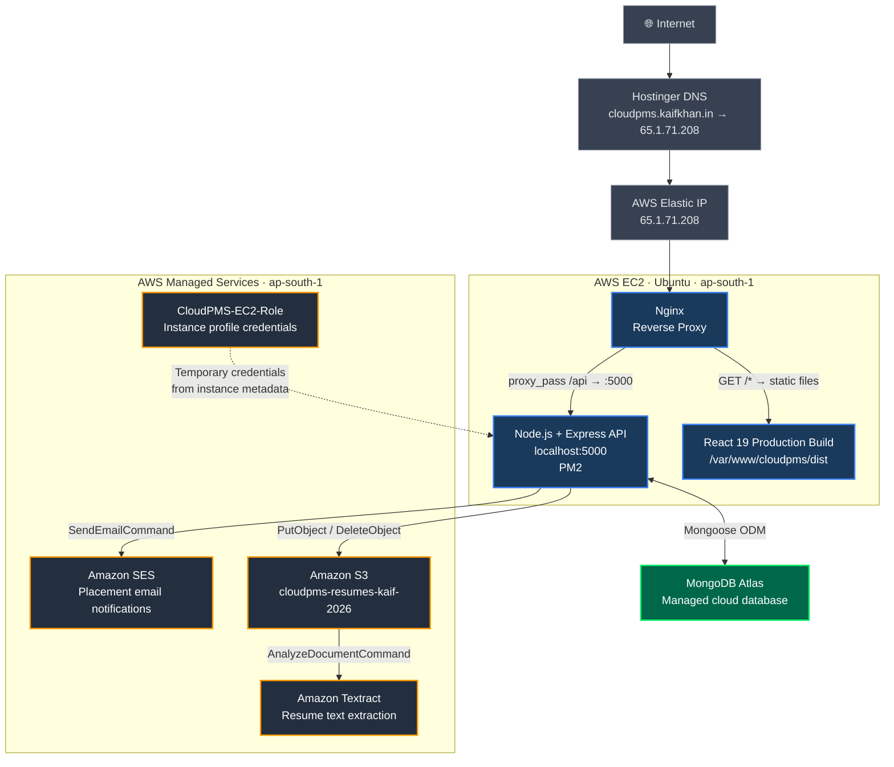

# ☁️ CloudPMS — Cloud-Based Campus Placement Management System

[](https://nodejs.org)
[](https://react.dev)
[](https://www.mongodb.com/atlas)
[](https://aws.amazon.com)

**MCA Final Year Project · DSCC / Cloud Computing**
**Team of 3 · Deployed on AWS EC2 · Region: ap-south-1 (Mumbai)**

🌐 **Live**: [http://cloudpms.kaifkhan.in](http://cloudpms.kaifkhan.in)

---

## Table of Contents

1. [Project Overview](#1-project-overview)
2. [Key Features](#2-key-features)
3. [User Roles](#3-user-roles)
4. [Technology Stack](#4-technology-stack)
5. [Cloud Architecture](#5-cloud-architecture)
6. [AWS Services](#6-aws-services)
7. [Project Structure](#7-project-structure)
8. [Authentication Workflow](#8-authentication-workflow)
9. [Role-Based Access Control](#9-role-based-access-control)
10. [API Reference](#10-api-reference)
11. [Core Data Models](#11-core-data-models)
12. [Resume Upload & Processing Flow](#12-resume-upload--processing-flow)
13. [Environment Variables](#13-environment-variables)
14. [Local Development](#14-local-development)
15. [Production Deployment](#15-production-deployment)
16. [EC2 Deployment Runbook](#16-ec2-deployment-runbook)
17. [Health Check](#17-health-check)
18. [Security](#18-security)
19. [Future Improvements](#19-future-improvements)
20. [Team](#20-team)

---

## 1. Project Overview

CloudPMS is a cloud-based campus placement management system for educational institutions. It centralises student academic profiles, placement drives, eligibility screening, application tracking, resume storage, and placement notifications on a single platform.

Three user roles interact with the system — **Students**, **Placement Cell officers**, and **Administrators** — each with clearly separated capabilities enforced by JWT-based authentication and role-based access control middleware.

The application is deployed on **AWS EC2** in the `ap-south-1` region, served through **Nginx** acting as a reverse proxy, with the Node.js backend managed by **PM2**. Cloud object storage, document analysis, and email notifications are provided by **Amazon S3**, **Amazon Textract**, and **Amazon SES** respectively.

---

## 2. Key Features

- **Student registration and profile management** — academic data including branch, CGPA, backlog count, 10th and 12th percentages
- **Resume upload to Amazon S3** — PDF files uploaded server-side via `PutObjectCommand`; no client-side presigned uploads
- **Automated skill extraction** — AWS Textract processes uploaded resumes; detected skills are saved to the student profile
- **Eligibility-filtered drive listing** — students see only drives they are eligible for (branch, CGPA, backlog criteria)
- **Drive application workflow** — apply, track status through `Applied → Shortlisted → Interview Scheduled → Selected | Rejected`
- **Placement Cell drive management** — create, edit, close drives; view and filter applicants by status
- **SES email notifications** — HTML-formatted emails dispatched on application status changes
- **Admin dashboard** — user management, account status toggle, drive reports, summary statistics
- **Google OAuth login** — `POST /api/auth/google` token exchange alongside standard email/password login
- **JWT authentication** — short-lived access token + long-lived `httpOnly` refresh token cookie with MongoDB-backed invalidation

---

## 3. User Roles

| Role | Identifier | Key Capabilities |
|---|---|---|
| **Student** | `student` | Profile management, resume upload, view eligible drives, apply, track application status |
| **Placement Cell** | `placement_cell` | Create/edit/close drives, view applicants, update application status and remarks |
| **Admin** | `admin` | All placement_cell permissions, user management, account toggle, placement reports, dashboard stats |

---

## 4. Technology Stack

| Layer | Technology | Details |
|---|---|---|
| Frontend | React + Vite | React 19, Vite 8 |
| Styling | Tailwind CSS | v3, utility-first |
| Icons | Lucide React | Icon library |
| HTTP Client | Axios | v1, with interceptor-based token refresh |
| Routing | React Router DOM | v7, protected routes |
| Charts | Recharts | v3, admin reports |
| Google OAuth (client) | @react-oauth/google | Token passed to `/api/auth/google` |
| Backend | Node.js + Express | Express 4, Node ≥ 18 |
| Database | MongoDB Atlas | Mongoose 8 ODM |
| Authentication | JWT | `jsonwebtoken` — access + refresh tokens |
| Authorization | RBAC middleware | `allowRoles()` on all protected route groups |
| File Upload | Multer | `memoryStorage` — buffer to S3, no disk writes |
| File Storage | Amazon S3 | AWS SDK v3 `PutObjectCommand` / `DeleteObjectCommand` |
| Document Analysis | Amazon Textract | AWS SDK v3 `AnalyzeDocumentCommand` |
| Email | Amazon SES | AWS SDK v3 `SendEmailCommand` |
| Compute | Amazon EC2 | Ubuntu, ap-south-1 |
| Web Server | Nginx | Static frontend + `/api` reverse proxy |
| Process Manager | PM2 | Node.js process lifecycle |
| Cloud Credentials | AWS IAM | `CloudPMS-EC2-Role` instance profile on EC2 |
| DNS | Hostinger | A record → Elastic IP `65.1.71.208` |
| Input Validation | express-validator | Body/param validation chains |
| Security Headers | Helmet | HTTP security headers |
| Password Hashing | bcryptjs | 12 salt rounds |
| Request Logging | Morgan | `combined` in production |
| Rate Limiting | express-rate-limit | 20 req / 15 min on `/api/auth` in production |

---

## 5. Cloud Architecture



### Nginx Routing

| Request | Nginx Action |
|---|---|
| `GET /`, `GET /login`, all frontend routes | Serve `dist/index.html` (React SPA) |
| `GET /api/*`, `POST /api/*` | `proxy_pass http://127.0.0.1:5000` → Express |

---

## 6. AWS Services

### Amazon EC2
- Ubuntu instance in `ap-south-1`, Elastic IP `65.1.71.208`
- Runs both Nginx (web server) and Node.js/Express (API)
- PM2 manages the backend process with auto-restart
- Nginx serves the compiled React `dist/` directory and proxies `/api` to Express on port 5000

### Amazon S3 — `cloudpms-resumes-kaif-2026`
- Stores student resume PDF files
- Backend uses `PutObjectCommand` to upload file buffer directly from RAM (Multer `memoryStorage`) — no disk writes, no client-side presigned uploads
- `DeleteObjectCommand` removes the previous resume when a student re-uploads
- Public access is blocked; objects are accessed directly by the backend SDK
- S3 URL is stored in the `resumePath` field of `StudentProfile`

### Amazon Textract
- After a resume is uploaded to S3, `AnalyzeDocumentCommand` (feature types: `TABLES`, `FORMS`) is invoked
- Detected `LINE` text blocks are scanned for known skill keywords
- Extracted skills are saved to the student's `skills` field in MongoDB

### Amazon SES
- `SendEmailCommand` sends HTML-formatted notifications from `AWS_SES_SENDER_EMAIL`
- Triggered on application status updates by the Placement Cell
- Sender identity must be verified in SES; SES sandbox restrictions apply until production access is granted
- No `SourceArn` is set — same-account sending with a directly verified sender identity

### AWS IAM — `CloudPMS-EC2-Role`
- The EC2 instance has `CloudPMS-EC2-Role` attached as an instance profile
- The AWS SDK v3 default credential provider chain resolves credentials from the EC2 instance metadata service automatically
- No static `AWS_ACCESS_KEY_ID` / `AWS_SECRET_ACCESS_KEY` are set on the production server
- For local development, credentials are supplied via `.env` or `~/.aws/credentials`

---

## 7. Project Structure

```
CloudPMS-PlacementPortal/
├── client/                         # React 19 + Vite frontend
│   ├── src/
│   │   ├── api/                    # Axios instance + per-module API calls
│   │   ├── components/             # Shared UI components (Navbar, etc.)
│   │   ├── context/                # AuthContext — token state management
│   │   ├── pages/
│   │   │   ├── Login.jsx
│   │   │   ├── Register.jsx
│   │   │   ├── admin/              # AdminDashboard, Reports, Users
│   │   │   ├── placement/          # ManageDrives, DriveApplicants
│   │   │   └── student/            # Profile, Drives, Applications
│   │   ├── utils/                  # Shared helpers
│   │   ├── App.jsx                 # Routes + protected route wrappers
│   │   └── main.jsx
│   ├── .env                        # VITE_API_BASE_URL, VITE_GOOGLE_CLIENT_ID
│   └── package.json
│
├── server/                         # Node.js + Express backend
│   ├── src/
│   │   ├── app.js                  # Express app config, middleware, routes
│   │   ├── config/
│   │   │   └── awsClients.js       # S3, Textract, SES SDK clients (region only)
│   │   ├── controllers/            # auth, student, placement, admin
│   │   ├── middleware/             # auth, role, upload, validate
│   │   ├── models/                 # User, StudentProfile, Drive, Application
│   │   ├── routes/                 # auth, student, placement, admin, index
│   │   └── utils/                  # ApiError, ApiResponse, awsServices, generateToken
│   ├── server.js                   # Entry point — connects DB, starts server
│   ├── .env                        # Server environment variables
│   ├── .env.example                # Template (no secrets)
│   └── package.json
│
└── README.md
```

---

## 8. Authentication Workflow

CloudPMS uses a **stateless + stateful hybrid** JWT strategy:

- **Access token** — 15-minute lifetime, signed with `JWT_ACCESS_SECRET`, stored in React memory (not `localStorage`)
- **Refresh token** — 7-day lifetime, signed with `JWT_REFRESH_SECRET`, stored in an `httpOnly` / `secure` / `sameSite=none` cookie **and** persisted in MongoDB for server-side invalidation

```
POST /api/auth/register   → Account creation, tokens issued
POST /api/auth/login      → Email + password, tokens issued
POST /api/auth/google     → Google access token exchange, find-or-create user, tokens issued

Protected requests:
  Authorization: Bearer <accessToken>

POST /api/auth/refresh    → Reads cookie, validates against DB, rotates both tokens
GET  /api/auth/me         → Returns current user from access token claims
POST /api/auth/logout     → Sets refreshToken = null in DB, clears cookie
```

### Cookie Properties

| Property | Value |
|---|---|
| `httpOnly` | `true` — inaccessible to JavaScript |
| `secure` | `true` in production (HTTPS) |
| `sameSite` | `none` in production, `lax` in development |
| `maxAge` | 7 days |

---

## 9. Role-Based Access Control

Roles are stored in the `User` document and enforced by the `allowRoles(...roles)` middleware applied at the route group level — not per-endpoint.

| Role | Route Prefix | Permitted Actions |
|---|---|---|
| `student` | `/api/students` | Own profile, resume upload, eligible drives, apply, own applications |
| `placement_cell` | `/api/placement` | Create/edit/close drives, view applicants, update application status |
| `admin` | `/api/placement` + `/api/admin` | All placement_cell actions + user list, account toggle, dashboard, reports |

---

## 10. API Reference

### Auth — `/api/auth`

| Method | Path | Auth | Description |
|---|---|---|---|
| `POST` | `/register` | Public | Register with name, email, password, role |
| `POST` | `/login` | Public | Email + password login |
| `POST` | `/google` | Public | Google OAuth token exchange |
| `POST` | `/refresh` | Cookie | Rotate tokens using refresh cookie |
| `GET` | `/me` | Bearer | Get authenticated user |
| `POST` | `/logout` | Bearer | Invalidate refresh token, clear cookie |

### Student — `/api/students` _(role: student)_

| Method | Path | Description |
|---|---|---|
| `POST` / `PUT` | `/profile` | Upsert academic profile |
| `GET` | `/profile` | Get own profile |
| `POST` | `/resume` | Upload PDF resume to S3 (field: `resume`) |
| `GET` | `/drives` | List drives the student is eligible for |
| `POST` | `/drives/:driveId/apply` | Apply to a drive |
| `GET` | `/applications` | List own applications with current status |

### Placement Cell — `/api/placement` _(role: placement_cell, admin)_

| Method | Path | Description |
|---|---|---|
| `POST` | `/drives` | Create a placement drive |
| `GET` | `/drives` | List drives (own for placement_cell; all for admin) |
| `PUT` | `/drives/:id` | Edit drive details |
| `PATCH` | `/drives/:id/close` | Close drive → sets status to `Completed` |
| `GET` | `/drives/:id/applicants` | List applicants (query: `?status=`) |
| `PATCH` | `/applications/:appId/status` | Update application status and remarks |

### Admin — `/api/admin` _(role: admin)_

| Method | Path | Description |
|---|---|---|
| `GET` | `/dashboard` | Summary statistics |
| `GET` | `/users` | Paginated user list (query: `?role=`, `?page=`, `?limit=`) |
| `PATCH` | `/users/:id/toggle` | Activate or deactivate an account |
| `GET` | `/reports/drives` | Drive-wise application and selection report |

### System

| Method | Path | Auth | Description |
|---|---|---|---|
| `GET` | `/api/health` | Public | API status, environment, AWS config |

---

## 11. Core Data Models

### User
`name` · `email` · `password` (bcrypt) · `role` (`student|placement_cell|admin`) · `isVerified` · `refreshToken` (select:false) · `createdAt` · `updatedAt`

### StudentProfile
`user` (ref:User, 1-to-1) · `rollNumber` (unique) · `branch` (`MCA|BCA|BBA|BSc IT|BCom`) · `cgpa` (0–10) · `backlogCount` · `resumePath` (S3 URL) · `skills` (from Textract) · `tenthPercent` · `twelfthPercent` · `isPlaced`

### Drive
`company` · `jobRole` · `ctc` (LPA) · `description` · `eligibility` {`minCgpa`, `allowedBranches`, `maxBacklogs`} · `deadline` · `driveDate` · `venue` · `postedBy` (ref:User) · `status` (`Upcoming|Ongoing|Completed`)

### Application
`student` (ref:StudentProfile) · `drive` (ref:Drive) · `status` (`Applied|Shortlisted|Interview Scheduled|Selected|Rejected`) · `appliedAt` · `remarks`

Compound unique index on `{ student, drive }` prevents duplicate applications at the database level.

---

## 12. Resume Upload & Processing Flow

```
Student submits PDF via browser form
        │
        ▼
POST /api/students/resume
        │
        ▼
Multer memoryStorage (req.file.buffer — no disk write)
        │
        ▼
Delete previous S3 object (if resumePath exists)
        │
        ▼
PutObjectCommand → S3 bucket: cloudpms-resumes-kaif-2026
  Key: resumes/<userId>/<timestamp>-<filename>.pdf
  ContentType: application/pdf
        │
        ▼
Build S3 URL → save to profile.resumePath
        │
        ▼
AnalyzeDocumentCommand (Textract) → TABLES + FORMS
        │
        ▼
Filter LINE blocks for known skill keywords
        │
        ▼
Save skills to profile.skills in MongoDB
        │
        ▼
Return { resumeUrl, skills } to client
```

---

## 13. Environment Variables

Create `server/.env` from `server/.env.example`. **Never commit `.env`.**

| Variable | Required | Description |
|---|---|---|
| `NODE_ENV` | Yes | `development` or `production` |
| `PORT` | No | Express port (default: `5000`) |
| `CLIENT_URL` | Yes | CORS origin (e.g. `https://cloudpms.kaifkhan.in`) |
| `MONGO_URI` | Yes | MongoDB Atlas connection string |
| `JWT_ACCESS_SECRET` | Yes | Access token signing secret (64-byte random hex) |
| `JWT_REFRESH_SECRET` | Yes | Refresh token signing secret (64-byte random hex) |
| `JWT_ACCESS_EXPIRES_IN` | No | Default: `15m` |
| `JWT_REFRESH_EXPIRES_IN` | No | Default: `7d` |
| `AWS_REGION` | Yes | `ap-south-1` |
| `AWS_S3_BUCKET_NAME` | Yes | `cloudpms-resumes-kaif-2026` |
| `AWS_SES_SENDER_EMAIL` | Yes | SES-verified sender email |
| `BCRYPT_SALT_ROUNDS` | No | Default: `12` |
| `GOOGLE_CLIENT_ID` | No | Google OAuth client ID |

**Local development only** (do not set on EC2 with IAM role):

| Variable | Description |
|---|---|
| `AWS_ACCESS_KEY_ID` | IAM user access key |
| `AWS_SECRET_ACCESS_KEY` | IAM user secret key |

Generate JWT secrets:
```bash
node -e "require('crypto').randomBytes(64).toString('hex')"
```

---

## 14. Local Development

### Prerequisites
- Node.js ≥ 18
- MongoDB Atlas cluster (or local MongoDB)
- AWS credentials configured locally for S3, Textract, SES

### Backend
```bash
cd server
npm install
cp .env.example .env   # fill in your values
npm run dev            # nodemon — auto-restart on file changes
```
API: `http://localhost:5000`

### Frontend
```bash
cd client
npm install
npm run dev            # Vite dev server with HMR
```
App: `http://localhost:5173`

> `VITE_API_BASE_URL=/api` — Vite proxies `/api` to `localhost:5000` in development.

---

## 15. Production Deployment

**Current URL**: `http://cloudpms.kaifkhan.in`
**HTTPS**: Pending — final hardening step using Certbot/Let's Encrypt.

### Overview

```
GitHub repo → EC2 SSH → git pull → npm ci → npm run build
                                 → PM2 restart
                                 → nginx -t && nginx reload
```

### Hostinger DNS

| Type | Host | Value | TTL |
|---|---|---|---|
| A | `cloudpms` | `65.1.71.208` | 300 |

---

## 16. EC2 Deployment Runbook

```bash
# Pull latest code
git pull origin main

# Update backend
cd server
npm ci
pm2 restart cloudpms
pm2 status

# Build and deploy frontend
cd ../client
npm ci
npm run build
sudo cp -r dist/* /var/www/cloudpms/dist/

# Validate and reload Nginx
sudo nginx -t
sudo systemctl reload nginx

# Check logs
pm2 logs cloudpms --lines 50
sudo tail -n 50 /var/log/nginx/error.log
```

---

## 17. Health Check

```bash
curl http://localhost:5000/api/health
```

```json
{
  "success": true,
  "statusCode": 200,
  "message": "CloudPMS API is healthy",
  "data": {
    "status": "ok",
    "environment": "production",
    "timestamp": "2026-09-30T00:00:00.000Z",
    "aws": {
      "configured": true,
      "region": "ap-south-1",
      "s3Bucket": "cloudpms-resumes-kaif-2026",
      "sesSender": "noreply@yourdomain.com",
      "textractReady": true
    }
  }
}
```

> `awsConfigured` is `true` when `AWS_REGION` and `AWS_S3_BUCKET_NAME` are set. Static credential env vars are not checked because EC2 uses the IAM role.

---

## 18. Security

| Measure | Implementation |
|---|---|
| Secret storage | `server/.env`, excluded from Git via `.gitignore` |
| AWS credentials | No hardcoded credentials; IAM role on EC2, env vars locally |
| S3 bucket | Public access blocked; backend SDK accesses objects |
| Password storage | bcryptjs, 12 salt rounds |
| JWT | Short-lived access token + invalidatable refresh token in httpOnly cookie |
| Token revocation | Refresh token stored in MongoDB — logout sets it to `null` |
| Security headers | Helmet on all responses |
| CORS | Restricted to `CLIENT_URL`; credentials enabled |
| Rate limiting | `express-rate-limit` on `/api/auth` — 20 req / 15 min in production |
| Input validation | `express-validator` on all user-facing routes |
| Role enforcement | `allowRoles()` middleware on all protected route groups |

---

## 19. Future Improvements

- HTTPS via Let's Encrypt / Certbot (in progress)
- SES production access (move out of sandbox for unrestricted recipient sending)
- S3 presigned URLs for time-limited, authenticated resume download links
- Admin verification workflow for newly registered Placement Cell accounts
- Pagination on student drives and applications list
- Advanced placement analytics and year-over-year comparison charts
- Automated interview scheduling integration

---

## 20. Team

**CloudPMS Team — MCA Final Year Project**

*Built on AWS (EC2 · S3 · Textract · SES · IAM) · MongoDB Atlas · React 19 · Node.js · Nginx · PM2*
